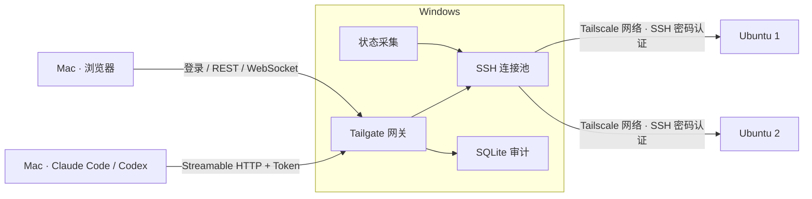

# Tailgate

Tailgate 是运行在 Windows 上的 SSH 网关。Mac 通过局域网访问 Windows，Windows 再通过已有的 Tailscale 网络连接多台 Ubuntu；Mac 无需安装 Tailscale。

同一个程序提供两种入口：Claude Code / Codex 使用带 Bearer Token 的 MCP；人使用中文网页、账号登录、终端和日志查看器。所有远端操作写入 SQLite 审计日志，SSH 登录账号决定实际权限。



## 功能

- 主机状态：CPU、负载、内存、swap、磁盘、失败服务、Top 进程；每 15 秒采集并共享缓存。
- 网页终端：本地打包的 xterm.js、自适应窗口、多主机独立标签；SSH PTY 会话可直接交互。
- 日志查看器：文件或 systemd unit，实时跟踪、服务端过滤、关键字高亮、暂停/继续。
- 操作审计：按 AI / 网页 / 终端、主机、使用者、时间和关键字筛选，查看命令、退出码与输出摘要。
- 管理：主机增删改、连接测试、指纹更新、Token 创建/撤销、网页用户与密码管理。
- Windows 服务、DPAPI 加密、来源网段限制、HTTPS、自签名证书、日志轮转。
- 前端无构建步骤、无 CDN；Windows 产物为单个 `tailgate.exe`，不需要安装 Go、Node 或 SQLite。

## 构建与本地开发

源码需要 **Go 1.26 或更新版本**。需求中的 Go 1.22+ 包含这一版本；当前固定的加密库和 SQLite 依赖要求 Go 1.26。Windows 使用 amd64，构建时 `CGO_ENABLED=0`。

```sh
go test ./...
go vet ./...
CGO_ENABLED=0 go build -o dist/tailgate ./cmd/tailgate
CGO_ENABLED=0 GOOS=windows GOARCH=amd64 go build \
  -trimpath -ldflags '-s -w -X main.version=0.1.0' \
  -o dist/tailgate.exe ./cmd/tailgate
```

仓库的构建入口如下，Windows 产物固定为 `dist/tailgate.exe`：

```sh
make build VERSION=0.1.0       # Windows amd64，关闭 CGO
make build-local VERSION=dev  # 当前平台，dist/tailgate
make test
make race
make vet
make staticcheck
make check                   # test + vet + staticcheck
make integration             # 先启动 Docker fixture
```

Windows PowerShell 使用 `./scripts/build.ps1 -Version 0.1.0`；可用 `-Go` 指定 Go 可执行文件。Make 可用 `GO=/完整路径/go` 指定版本。

```sh
go run ./cmd/tailgate --data-dir ./data init
go run ./cmd/tailgate --data-dir ./data host add
go run ./cmd/tailgate --data-dir ./data run
```

`init` 与密码管理命令需要交互式终端，密码输入不回显。Mac/Linux 开发环境会警告 DPAPI 不可用，并使用数据目录中的 `secret.key`（0600）进行 AES-GCM 加密。不要把 `data/`、密钥或数据库提交到 Git。

## Windows 部署

### 1. 准备网络与 SSH

在 Windows 安装并登录 [Tailscale](https://tailscale.com/download/windows)，确保 Windows 能访问 Ubuntu 的 Tailscale IP 或 MagicDNS 名称。Ubuntu 需要运行 OpenSSH server，并允许目标账号使用密码或 keyboard-interactive 登录；可参照 [Ubuntu 官方 OpenSSH 文档](https://ubuntu.com/server/docs/how-to/security/openssh-server/)。

目标 Ubuntu 需要标准 `/bin/bash`、GNU findutils/coreutils、GNU grep，以及 awk 和状态采集使用的 procps 工具。常规 Ubuntu 安装已具备这些组件；精简容器需要补齐。`list_dir` 依赖 GNU find 的格式化输出，`search_files` 使用 Bash 的管道错误传播；实时 systemd 日志还需要 journalctl 和相应账号权限。

Windows 只需要已有的 Tailscale 客户端；Tailgate 自己实现 SSH 客户端。Mac 的 MCP 地址应填写 **Windows 局域网地址**，例如 `192.168.1.10`；主机配置中的地址填写 **Ubuntu Tailscale 地址**，例如 `100.101.102.103`。

### 2. 初始化并添加主机

将 exe 放在固定位置，例如 `C:\Tailgate\tailgate.exe`。以管理员身份打开 PowerShell：

```powershell
cd C:\Tailgate
.\tailgate.exe init
.\tailgate.exe host add
.\tailgate.exe host test --all
.\tailgate.exe token create mac-claude-code
.\tailgate.exe token create mac-codex
```

`init` 创建配置和数据库，并引导创建第一位网页管理员。Token 明文只打印一次，请立即放入安全凭证存储。配置只保留 Token 的 SHA-256 哈希与 DPAPI 密文。

Windows 使用机器级 DPAPI，使 CLI 添加的密码可以由 LocalSystem 服务解密；数据目录会设置为仅 **Administrators 与 SYSTEM** 可访问。因此初始化、CLI 管理和前台运行使用提升权限的终端。

### 3. 配置监听与来源范围

编辑 `C:\ProgramData\Tailgate\config.yaml`，将监听和网段改为实际局域网，例如：

```yaml
server:
  listen: "192.168.1.10:8722"
  allowed_cidrs: ["192.168.1.0/24", "127.0.0.1/32", "::1/128"]
  tls:
    enabled: false
    auto_self_signed: true
```

完整注释见 [config.example.yaml](config.example.yaml)。修改 `hosts`、Token 或来源 CIDR 会热加载；监听地址、MCP 路径、TLS、SSH 池参数、审计策略和采集间隔修改后重启。外部 YAML 编辑失败时保留最后一份有效配置，并记录错误。

### 4. 前台验证、安装服务与放行防火墙

```powershell
.\tailgate.exe run
```

从 Mac 打开 `http://192.168.1.10:8722/`，登录并检查主机详情、终端和审计。若 Windows 防火墙尚未放行，在另一个管理员 PowerShell 中运行 `tailgate.exe firewall`，核对并执行它打印的规则后再访问。验证后按 Ctrl+C 停止前台程序，再安装服务：

```powershell
.\tailgate.exe install
.\tailgate.exe start
.\tailgate.exe status
.\tailgate.exe firewall
```

`firewall` **只打印**对应监听端口与 `allowed_cidrs` 的 PowerShell 防火墙命令。核对后在管理员 PowerShell 中执行输出命令。服务名为 Tailgate，使用 LocalSystem、开机自动延迟启动；异常退出在 5 秒后恢复重启，恢复计数 24 小时后重置，主动 `stop` 保持停止。

```powershell
.\tailgate.exe stop
.\tailgate.exe restart
.\tailgate.exe uninstall
```

exe 注册后保持原路径；更新文件前先停止服务。若使用自定义数据目录，初始化、安装和管理时一致传入 `--data-dir D:\TailgateData`。

## Mac 配置 Claude Code

以下 HTTP 传输与 `--header` 语法已对照 [Claude Code 官方 MCP 文档](https://code.claude.com/docs/en/mcp) 核对（2026-10-04）。将变量替换为创建时取得的 Token：

```sh
export TAILGATE_MCP_TOKEN='替换为刚创建的 Token'
claude mcp add --transport http --scope user tailgate \
  http://192.168.1.10:8722/mcp \
  --header "Authorization: Bearer $TAILGATE_MCP_TOKEN"
claude mcp list
```

在 Claude Code 内用 `/mcp` 查看连接，然后让它先调用 `list_hosts`。CLI `--header` 示例会把展开后的凭证存入客户端配置；不要分享该配置。需要通过环境变量读取凭证时，可使用 Claude 支持的 `.mcp.json`：

```json
{
  "mcpServers": {
    "tailgate": {
      "type": "http",
      "url": "http://192.168.1.10:8722/mcp",
      "headers": { "Authorization": "Bearer ${TAILGATE_MCP_TOKEN}" }
    }
  }
}
```

`${TAILGATE_MCP_TOKEN}` 保持字面量写入 JSON；启动 Claude 时在其环境中提供变量。不要将真实 Token 写入仓库。

## Mac 配置 Codex

编辑 `~/.codex/config.toml`：

```toml
[mcp_servers.tailgate]
url = "http://192.168.1.10:8722/mcp"
bearer_token_env_var = "TAILGATE_MCP_TOKEN"
startup_timeout_sec = 15
tool_timeout_sec = 620
```

启动 Codex 的环境里设置 **原始 Token**，不添加 `Bearer ` 前缀：

```sh
export TAILGATE_MCP_TOKEN='替换为刚创建的 Token'
codex mcp list
codex
```

Codex 根据 `url` 使用 Streamable HTTP，并用 `bearer_token_env_var` 生成 Authorization 头。该配置已对照 [OpenAI 官方 MCP 文档](https://learn.chatgpt.com/docs/extend/mcp?surface=cli) 核对（2026-10-04）。桌面应用需要从能继承该变量的环境启动，或通过其支持的环境配置传入；另一个终端中临时 `export` 不会修改已运行应用的环境。

Tailgate 默认命令超时 60 秒、最大 600 秒；Codex 示例的工具超时预留了返回与排队余量。十个工具的完整参数、结果与错误见 [MCP 工具文档](docs/mcp-tools.md)。

## 浏览器使用

访问 Windows 局域网地址并登录。总览自动刷新；详情显示完整磁盘、服务和进程信息。CPU 第一次采样为 `—`，第二次开始显示差值使用率。没有 systemd 的主机显示“服务状态未提供”，不会冒充“零失败服务”。

网页终端支持多个标签与窗口自适应；退出登录、关闭标签或页面时关闭对应会话。日志支持文件与 systemd 两种来源，后台接收缓冲有上限；“暂停”暂停显示，“停止”结束远端跟踪。操作审计的“只看 AI 操作”筛选 `mcp` 来源，Token 名称即 AI 使用者。时间统一显示为北京时间。

普通网页用户可查看主机、使用终端和工具；管理员还可访问设置。两者远端权限均由各主机的 SSH 账号决定。设置里新增/修改主机密码后立即加密；Token 创建弹窗关闭后清除明文。

## HTTPS 与 Mac 信任证书

将 `server.tls.enabled` 改为 `true` 并重启。`auto_self_signed: true` 首次在数据目录生成 `tls/server.crt` 与 `tls/server.key`；证书有效期三年，包括 localhost、本机 hostname、监听地址和当前网络 IP，TLS 最低版本为 1.2。随后使用 `https://192.168.1.10:8722/` 与同协议的 MCP 地址。也可以提供 `cert_file` / `key_file` 并关闭自动生成。

通过可信方式将 **server.crt 公钥证书**复制到 Mac，例如保存为 `~/tailgate-server.crt`。核对证书指纹后在“钥匙串访问”中导入系统钥匙串并设为信任，或执行：

```sh
openssl x509 -in ~/tailgate-server.crt -noout -fingerprint -sha256
sudo security add-trusted-cert -d -r trustRoot \
  -k /Library/Keychains/System.keychain ~/tailgate-server.crt
curl --cacert ~/tailgate-server.crt https://192.168.1.10:8722/
```

CLI 可显式追加此证书，并重新启动客户端：

```sh
export NODE_EXTRA_CA_CERTS="$HOME/tailgate-server.crt"
export CODEX_CA_CERTIFICATE="$HOME/tailgate-server.crt"
```

对应设置见 [Claude Code 证书文档](https://code.claude.com/docs/en/network-config) 与 [OpenAI 自定义 CA 文档](https://learn.chatgpt.com/docs/auth#custom-ca-bundles)。不要复制 `server.key` 到 Mac，也不要关闭 TLS 验证。已有证书重启后保持不变；证书过期或 Windows IP 变化导致名称不匹配时，需要更换证书并让客户端重新信任，步骤见 [运维文档](docs/operations.md)。

## CLI 速查

| 命令 | 用途 |
|---|---|
| `init` / `run` / `version` | 初始化、前台运行、版本 |
| `host add` / `host list` / `host remove NAME` | 主机管理 |
| `host set-password NAME` | 重新加密并更新 SSH 密码 |
| `host test NAME` / `host test --all` | SSH 连通性、延迟、指纹与系统版本 |
| `user add NAME` / `user passwd NAME` / `user remove NAME` | 网页用户管理；CLI 添加用户为管理员 |
| `token create NAME` / `token list` / `token revoke NAME` | MCP 凭证管理 |
| `install` / `uninstall` / `start` / `stop` / `restart` / `status` | Windows 服务管理 |
| `firewall` | 打印防火墙规则命令 |

`--data-dir` 可放在命令前后。可选的 `host discover` 未实现，请使用 `host add` 或网页添加主机。

## 测试

```sh
go install honnef.co/go/tools/cmd/staticcheck@v0.8.1
go test -race ./...
go vet ./...
staticcheck ./...
```

`staticcheck` 固定为 v0.8.1（2026.2.1），不属于运行依赖。确保 Go 安装工具的目录在 PATH 中，或使用 `make staticcheck STATICCHECK="$(go env GOPATH)/bin/staticcheck"`。Docker 集成测试启动两台本地密码 SSH 容器，覆盖连接池、MCP 和状态采集：

```sh
docker compose up -d --build --wait
go test -tags=integration -count=1 ./...
docker compose down --volumes --remove-orphans
```

也可运行 `scripts/integration.sh` 自动启动、测试和清理。容器监听 `127.0.0.1:19721`、`127.0.0.1:19722`；Compose 中的密码仅用于开发 fixture。测试不连接你的真实 Ubuntu，也不验证生产 Tailscale 路由。实际验证范围见 [验证记录](docs/validation.md)。

## 常见问题

| 现象 | 检查与处理 |
|---|---|
| Mac 连接超时 | 先确认 Windows 局域网 IP、监听地址、实际端口、Windows 防火墙及 `allowed_cidrs`；不能填 Ubuntu 的 100.x 地址作为 MCP 网关地址。 |
| 主机 SSH 超时 | 在 Windows 检查 Tailscale 登录与目标在线状态、tailnet ACL、Ubuntu SSH 端口；执行 `host test NAME`。 |
| 指纹变化被拒绝 | 到设置查看新旧指纹，通过服务器控制台核对，再明确确认更新；不要删除整个 `known_hosts` 绕过保护。 |
| 密码错误 | 使用 `host set-password NAME`；确认 Ubuntu 账号未锁定、密码认证或 keyboard-interactive 开启。 |
| 仅 keyboard-interactive 可登录 | Tailgate 同时提供 password 与 keyboard-interactive；配置的密码用于密码提示，不提供 OTP/MFA 对话。 |
| sudo 等待或认证失败 | 自动注入仅对以 `sudo ` 开头的命令启用，使用 `sudo -S -p ''` 与 stdin；SSH 密码必须也是 sudo 密码。TTY/MFA sudo 策略需要管理员调整或使用网页交互终端。 |
| MCP 401 | 检查原始 Token、是否撤销，以及客户端实际运行环境中是否存在变量；网页 Cookie 不能用于 MCP。 |
| WebSocket 403 | 从相同协议/主机/端口的网页使用终端；会话、Origin 和 CSRF 必须有效。 |
| Access denied / DPAPI 解密失败 | Windows CLI 使用管理员终端；密文不能迁移到另一台 Windows；机器更换后重新录入主机密码。 |
| SQLite / 审计错误 | 检查磁盘空间、目录权限与运行日志。审计持久化失败后拒绝新操作，修复后重启服务。 |
| 停止服务较慢 | 已执行的非交互命令有机会在最大命令超时内结束；WebSocket 先关闭，再等待 HTTP、连接池和审计刷盘。Windows 重启/关机仍受操作系统服务停止期限约束，不能保证长命令全部结束。 |

## 数据与设计决策

默认 Windows 数据目录为 `C:\ProgramData\Tailgate\`，开发环境为 `./data/`：

```text
config.yaml        # 配置、加密 SSH 密码、Token 哈希
tailgate.db        # 审计、bcrypt 网页密码、哈希会话
known_hosts        # TOFU SSH 主机指纹
logs/tailgate.log  # JSON 日志，10 MB 轮转，5 份备份，保留 30 天并 gzip
tls/               # 可选证书和私钥
secret.key         # 仅 Mac/Linux 开发使用
```

- Windows 服务选用 `kardianos/service`：复用服务控制和前台入口，配合 Windows 原生恢复设置；密码保护仍使用 `x/sys/windows` DPAPI。
- MCP 使用官方 Go SDK 的 stateless Streamable HTTP 和 JSON 响应，兼容新协议与旧初始化客户端，逐请求绑定 Token 名称、实际来源 IP 与取消信号。
- 不使用命令白名单或内置提权限制；工具指令要求 AI 在修改前说明意图，实际权限由远端账号决定。
- 审计队列默认 1,024 项、保留 90 天；队列满时同步写入避免丢记录，持久化失败后停止接受新操作。
- 终端记录会话开始/结束、使用者、主机与耗时，**不保存终端输入或完整原始输出**。工具输出保存有限首尾摘要；MCP 结果也受输出上限约束。
- HTTP 不信任 `X-Forwarded-For`；网页与 MCP 凭证分离。此版本直接监听局域网，不把反向代理地址当成用户来源。
- 主机状态后台采集也写入审计，来源 `web`、使用者 `monitor`。无法获取的指标保留为空，离线主机保留上一次成功指标与错误。
- CLI 管理动作与连接测试也审计，来源 `web`、使用者 `cli:本地用户名`；参数中的密码和 Token 不写入记录。
- 前端只有本地 HTML/CSS/JS。xterm 的运行时布局需要 CSP 允许内联样式；脚本仅允许同源外部文件，不接受内联脚本。
- Windows DPAPI 密文绑定当前机器；Mac/Linux AES 密文依赖开发密钥。跨机器或跨平台迁移配置后，重新录入主机密码。

更多说明见 [设计](docs/design.md)、[运维](docs/operations.md) 和 [需求对照](docs/requirements-checklist.md)。Windows DPAPI 实际加解密、SCM 服务恢复及真实 Tailscale 网络需要在目标 Windows 验收；Mac 测试与交叉编译不能代替这一验收。

## 第三方组件

| 组件 | 用途 |
|---|---|
| `golang.org/x/crypto` | SSH password / keyboard-interactive、known_hosts、bcrypt |
| `golang.org/x/sys` | Windows DPAPI、ACL 与服务相关原生 API |
| `golang.org/x/term` | CLI 密码不回显输入 |
| `github.com/modelcontextprotocol/go-sdk` | 官方 MCP schema、协议及 Streamable HTTP |
| `modernc.org/sqlite` | 无 CGO 的 SQLite 驱动 |
| `gopkg.in/yaml.v3` | YAML 解析、字段校验与配置注释 |
| `github.com/coder/websocket` | 终端与日志 WebSocket |
| `github.com/kardianos/service` | Windows 服务生命周期与控制命令 |
| `gopkg.in/natefinch/lumberjack.v2` | 运行日志按大小轮转 |
| `@xterm/xterm` 6.0.0 | 浏览器终端；MIT 许可 |
| `@xterm/addon-fit` 0.11.0 | 终端窗口尺寸适配；MIT 许可 |

Go 直接与传递依赖版本由 `go.mod` / `go.sum` 固定。xterm 原发行文件、许可、版本与已验证的 tarball SHA-512 在 `web/vendor/`。项目许可见 [LICENSE](LICENSE)。
