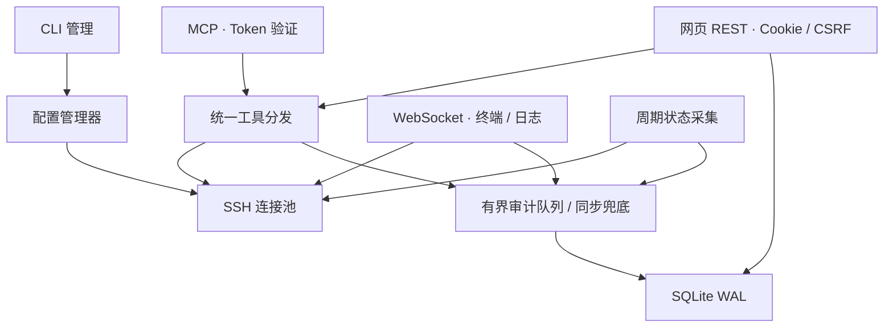

# Tailgate 设计

Tailgate 将“客户端入口”和“远端操作”分开：MCP、网页 REST、终端和日志共用配置、SSH 连接池与审计。Windows 负责已有 Tailscale 网络的路由，程序通过标准 SSH 连接目标主机，不嵌入 Tailscale 客户端。

## 包与职责

| 包 | 职责 |
|---|---|
| `cmd/tailgate` | CLI、交互密码、主机/用户/Token 管理 |
| `internal/app` | 组装资源、监听、后台任务、退出顺序 |
| `internal/config` | 严格 YAML 校验、原子保存、快照与热加载 |
| `internal/secret` | Windows DPAPI / 开发 AES-GCM、数据目录权限 |
| `internal/sshpool` | SSH 认证、连接池、TOFU、命令、PTY、日志流 |
| `internal/hosts` | 指标解析、采样、共享状态缓存 |
| `internal/command` | 十个工具的参数校验、执行和审计 |
| `internal/mcpserver` | 官方 SDK、类型化 schema、HTTP 认证与取消 |
| `internal/store` / `internal/audit` | 用户/会话数据库与审计持久化 |
| `internal/web` | 登录、管理 API、WebSocket、来源/CSRF/CSP |
| `internal/service` / `internal/transport` | Windows 服务与 TLS 生命周期 |
| `web` | 内嵌静态网页、xterm 及许可；无需前端构建 |

## 身份与权限

MCP 使用独立 Bearer Token。服务端只保存 SHA-256 哈希，认证对所有已配置哈希做常量时间比较；Token 名称写入审计的 `actor`。网页使用 bcrypt 密码和随机 Cookie 会话，数据库保存会话 Token 哈希，默认有效期 12 小时。Cookie 为 HttpOnly、SameSite=Strict，HTTPS 时启用 Secure。

管理员可管理主机、Token、网页用户和指纹；普通网页用户可使用配置的主机。所有网页用户和 MCP Token 共享主机配置中的 SSH 账号，未实现每用户 SSH 账号映射或命令白名单。权限、sudo 策略和文件访问由 Ubuntu 决定。

来源 CIDR 检查使用 TCP 对端 `RemoteAddr`，不信任 `X-Forwarded-For`。MCP 存在 Origin 时要求与当前协议、Host 完全一致；网页变更与 WebSocket 同时验证会话、同源和 CSRF。直接访问模式下，反向代理不是独立的用户来源识别入口。

网页动态内容使用文本节点渲染，包括日志高亮与审计输出。外部脚本仅来自同源；xterm 运行时布局需要内联样式，因此 CSP 允许样式内联。所有 JS/CSS、终端依赖与图标均内嵌，无 CDN。

## 密码与主机指纹

Windows 使用机器级 DPAPI，使管理员 CLI 与 LocalSystem 服务能共享密文；数据目录应用仅 Administrators/SYSTEM 的保护 DACL。保护依赖机器密钥和目录 ACL，不适用于跨机器密文复制。非 Windows 仅用于开发，使用独立的 0600 AES-GCM 密钥文件。

SSH 同时提供 password 和 keyboard-interactive，后者用配置密码响应密码提示，不支持 OTP/MFA 自动对话。开启 `sudo_password_inject` 后，仅以 `sudo ` 开头的非交互命令改为 `sudo -S -p ''`，密码通过 stdin 传入；已知密码会从工具返回与审计摘要中删除。

TOFU 第一次连接将指纹追加到 `known_hosts`；指纹变化拒绝连接。网页更新必须提交正在显示的预期新指纹，再连接核对一致后替换，避免确认期间变化。首次连接仍需要操作人员核对真实主机；后续变更需要明确确认。

## 连接与输出边界

每主机复用 SSH client，默认最多 8 个并发 session，连接超时 10 秒、keepalive 30 秒。配置变更替换相应主机连接；断线后重建连接。命令默认 60 秒，最大 600 秒，单次请求超出上限会被拒绝。

默认命令输出上限 262,144 字节。持续读取 stdout/stderr 防止远端阻塞，只保留受限首尾内容；返回 `truncated` 与实际总字节数。正常非零远端退出码保留在结果中，与连接、取消、超时等工具错误区分。

结构化目录结果需要完整、合法的 NUL 分隔记录；输出截断或字段损坏时拒绝解析，避免将首尾摘要当成真实目录项。文件搜索同样拒绝字节截断的路径输出，避免把路径片段或截断标记返回为文件。搜索使用 NUL 分隔保留含换行的文件名，依赖 `/bin/bash -o pipefail`、GNU find 与 GNU grep，限制返回数量后仍排空搜索输出以保留错误状态；数量上限不会限制目录遍历或内容扫描。目标使用常规 Ubuntu 命令工具集，精简镜像需补齐依赖。

取消请求会结束对应 session；需要关闭 client 时只关闭该 session 捕获的所属连接，避免误断后来创建的连接。PTY 和实时日志独占 session 生命周期，关闭页面、退出登录或关闭服务器时释放。

## 状态与审计

状态默认每 15 秒采集，网页和 MCP 共用缓存。CPU 使用率由两次 `/proc/stat` 采样计算，首次为 null；无法获取的字段为 null/空数组。`failed_services_available=false` 表示不能读取 systemd 服务状态，界面显示未提供。SSH 失败保留上一次成功指标，并标为离线和注明错误时间。

每个工具有开始与完成审计。SDK 在业务处理前拒绝的参数/schema 请求也记录拒绝事件。后台采集身份为 `source=web, actor=monitor`；MCP 为 `source=mcp`，终端为 `source=terminal`；CLI 管理与测试使用 `source=web, actor=cli:本地用户名, client_ip=local`。记录时间、使用者、实际来源 IP、主机、动作、命令、退出码、时长、总输出字节和有限摘要。终端只记录会话元数据，不保存输入或原始输出。

审计默认保留 90 天，队列 1,024 项。队列满时在调用者同步写入，避免因拥塞丢记录。持久化失败会使审计进入失败状态，拒绝新操作；存储修复后需要重启。异步记录意味着强制杀进程或断电仍可能损失未刷盘事件，正常停止会等待刷盘。

## 生命周期

服务选择 `kardianos/service` 提供安装和生命周期抽象，Windows 原生 API 补充恢复及状态控制。服务运行 LocalSystem，自动延迟启动，异常退出在 5 秒后重启，恢复计数 24 小时重置。主动停止不会当作异常恢复。服务控制命令只适用于 Windows；Mac/Linux 开发使用 `run`，不注册系统服务。

退出时停止采集和配置监听，停止接受 HTTP；WebSocket 在 15 秒预算内关闭。已执行 HTTP 请求有 `max_command_timeout + 15s` 的排空预算，随后关闭 SSH 池、刷审计并关闭 SQLite。Windows 手动服务停止预算为 `max_command_timeout + 45s`；重启/关机的操作系统强制期限可能更短。

hosts、Token、来源 CIDR 热加载。监听地址、MCP 路径、TLS、SSH 参数、采集间隔、审计策略在运行期间保持启动快照，改动后重启生效。

## 取舍与验证边界

MCP 使用官方 SDK v1.8.0 的 stateless Streamable HTTP，JSON 响应适合有界命令；逐请求绑定身份与取消，同时测试现代与旧初始化客户端。实时流使用 WebSocket，不通过 MCP 持续占用工具请求。

SQLite 选择无 CGO 驱动，Windows 可交叉构建单 exe；纯 Go SSH 避免依赖系统 ssh.exe。内嵌原生前端减少部署与构建依赖。可选主机自动发现未实现。

Docker fixture 验证真实 SSH、工具、取消和流会话。Alpine fixture 没有 systemd，实际 Ubuntu unit 查询、Windows DPAPI/SCM 和真实 Tailscale 网络需另行目标环境验收，详见 [验证记录](validation.md)。
