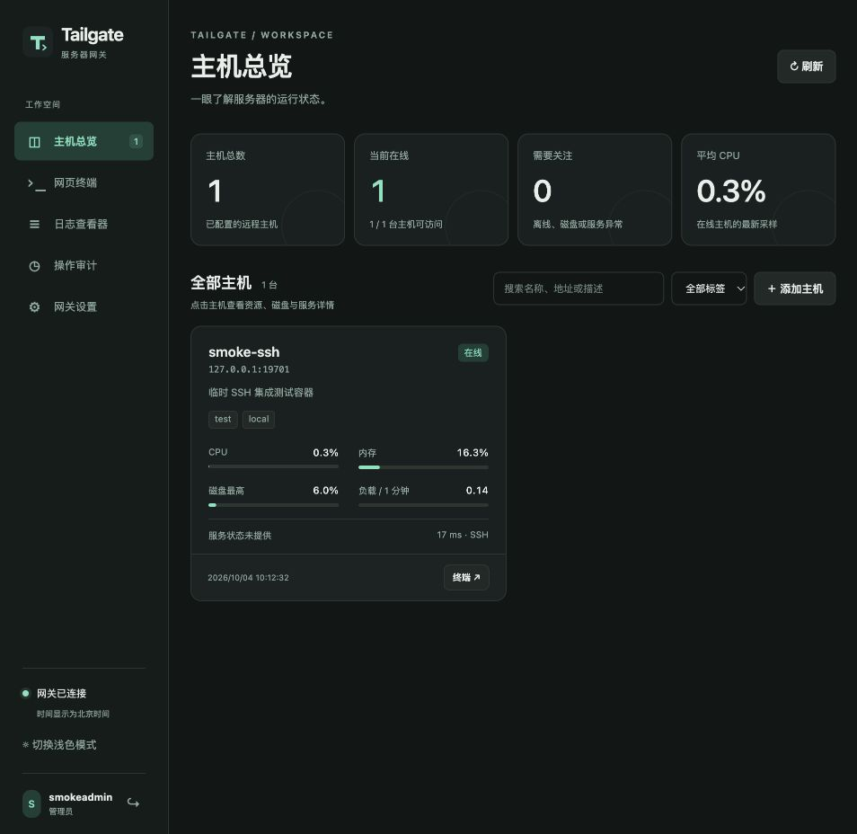
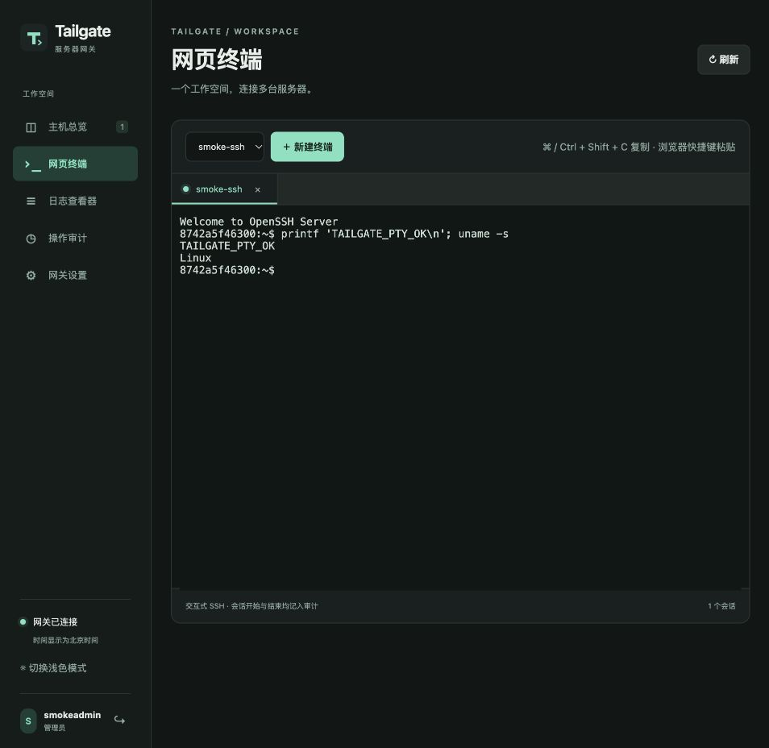
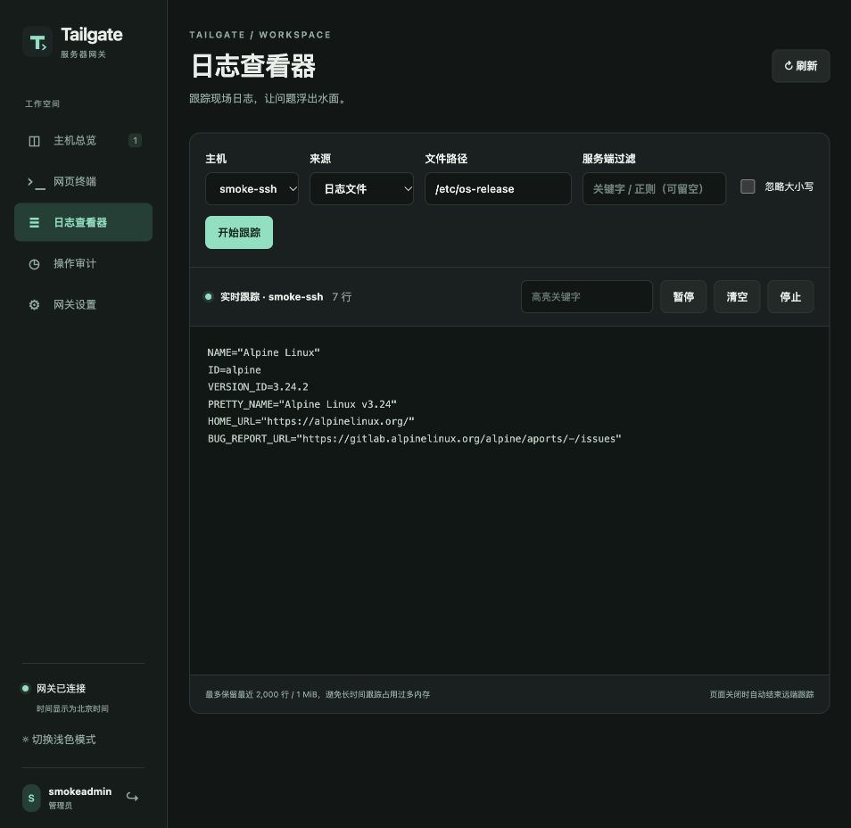

# 交付验证记录

验证日期：2026-10-04，北京时间。版本：`0.1.0`。

本次验证在 macOS arm64 上完成，使用 Go `1.27.1`、staticcheck `2026.2.1 (0.8.1)` 和本地 Docker。源码最低 Go 版本为 `1.26.0`，依赖由 `go.mod` / `go.sum` 固定。没有连接实际 Ubuntu、修改 Windows 防火墙或部署线上服务。

## 里程碑

按 M1 → M2 → M3 → M4 完成；每阶段通过当阶段测试、原生构建及 Windows 无 CGO 交叉构建后继续。

| 阶段 | 已验证内容 |
|---|---|
| M1 | 严格配置校验、热加载、开发密钥保护、用户/会话数据库、CLI、SSH 双认证、TOFU、连接复用、队列取消、sudo、输出截断 |
| M2 | 官方 MCP SDK Streamable HTTP 客户端；全部十个工具；现代与旧初始化协议；Token 认证、撤销、真实来源 IP；shell 转义与结构化错误；开始/完成及参数拒绝审计 |
| M3 | 状态采样与离线缓存；Web 登录、限速、Origin、CSRF、管理员权限；PTY/日志 WebSocket；用户与 Token 管理；内嵌网页和离线终端资源 |
| M4 | 服务生命周期单元测试；Windows 服务代码交叉检查；HTTPS 实际启动、受信证书、Secure Cookie、HSTS；优雅退出与审计刷盘；构建脚本、文档与真实 SSH 容器集成 |

## 最终检查

以下命令均成功退出，无 race 报告、vet 或 staticcheck 告警：

```sh
go test -race ./...
go vet ./...
staticcheck ./...
CGO_ENABLED=0 GOOS=windows GOARCH=amd64 staticcheck ./...
go mod verify
docker compose up -d --build --wait
go test -race -tags=integration -count=1 ./...
go vet -tags=integration ./...
docker compose down --volumes --remove-orphans
make build VERSION=0.1.0
make build-local VERSION=0.1.0
./dist/tailgate version
node --check web/app.js
sh -n scripts/integration.sh
git diff --check
```

版本命令输出 `Tailgate 0.1.0`。所有 Go 源码经过 gofmt 检查。PowerShell 构建脚本已提供；本机没有 PowerShell，因此脚本没有在 Windows 解释器中执行。

## 真实 SSH 与浏览器验证

两个 OpenSSH 容器使用不同密码账号，只绑定本机端口。测试覆盖全部十个 MCP 工具、并行多主机命令、真实 sudo 密码挑战、输出上限、状态两次采样、停止容器后的离线缓存，以及网页认证、PTY 窗口调整和日志追加推送。

超时和断开连接检查进一步确认：远端 `sleep`、PTY shell、`tail -F` 进程消失。实现先发送终止信号再关闭通道，避免通道提前关闭吞掉信号；测试还确认后续命令仍能执行。任意命令主动脱离会话启动的守护进程不在这一清理保证内。

最终复核增加了配置并发与文件工具回归：旧采集批次不能覆盖新 SSH 目标；配置监听能发现启动前后的文件修改并保留最后有效配置；搜索保留 find/grep 的真实失败，正常无匹配返回空结果；目录和搜索字节截断时返回明确错误，避免把不完整片段当成条目；含换行的合法文件名用 NUL 分隔保留。

集成容器底层为 Alpine，安装 GNU 工具模拟 Ubuntu 常用命令；没有 systemd，`journal` 和 `service_status` 验证工具的远端失败返回。Ubuntu 状态 fixture 和实际 Alpine 输出样本用于解析测试；真实 Ubuntu 的 systemd 成功路径尚未现场验证。

浏览器访问最终构建的本地服务，完成登录、主机连接测试、主机总览、终端命令、文件实时跟踪、停止跟踪及审计页检查，未发现浏览器控制台错误。截图使用一次性测试主机与账号：







测试容器和临时网关已停止并清理；不会保留后台监听。

## 构建产物

| 产物 | 平台 | SHA-256 |
|---|---|---|
| `dist/tailgate.exe` | Windows amd64，PE32+，CGO 禁用 | `80d827d5327de1dec113081cbecdb6882b95af26050142d8faa97d7a14476199` |
| `dist/tailgate` | macOS arm64，Mach-O，CGO 禁用 | `fe84b0e7520e3691315edec161a00320fa228eb520de3af48aa3809b187b3426` |

## Windows 部署端验收

交叉编译与平台静态检查确认 Windows 源码可构建，不能证明目标机运行成功。部署时按 [README](../README.md) 和 [运维文档](operations.md) 完成：

1. 管理员初始化，确认数据目录 ACL、DPAPI 密文及 LocalSystem 服务解密正常。
2. 通过 Tailscale 连接真实 Ubuntu，测试 password / keyboard-interactive、sudo 与 systemd 查询。
3. 安装、启动、停止、重启服务；测试异常恢复和重启 Windows 后自动启动。
4. 执行打印出的防火墙规则，从实际 Mac 验证来源限制、MCP、网页终端和日志。
5. 启用 HTTPS，在 Mac 信任证书后用 Claude Code 和 Codex 连接，确认对应 Token 名称出现在审计中。

Claude Code 与 Codex 配置语法已核对官方文档，见 README 中的来源链接；本次用官方 Go SDK 测试客户端验证 MCP，并未启动实际 Claude Code / Codex 会话。
